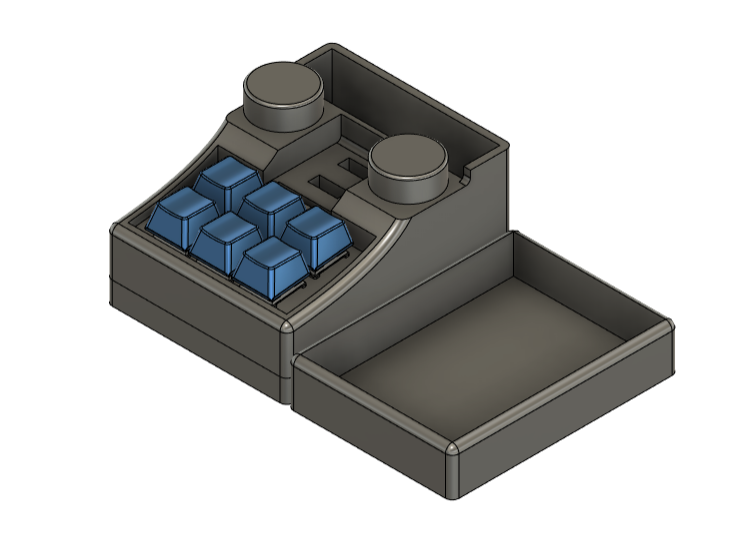
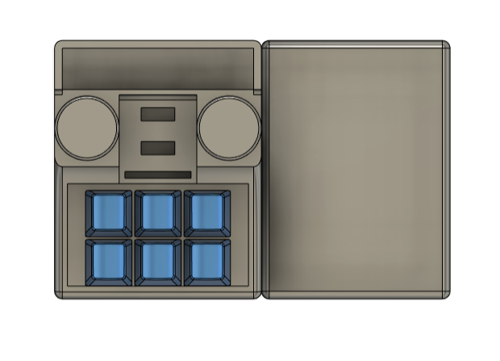

# TypePad_QMK_VIA

## Spesification
- RP2040 type C as Microcontroller
- QMK Firmware
- Support VIA, all key and knob can proggrammed
- 6 x Hotswap Switch
- 2 x Encoder Knob
- 3D Case
- 6 x RGB Backlight 

## VIA
- You can Download VIA on this [link](https://github.com/the-via/releases/releases)
- or you can go to this [web](https://usevia.app/)

## Auto Detect VIA
this Device can automatically detect on VIA, just need PC with Intercet Connection
- Connect your macropad to PC
- Open VIA
- It will auto detect
## Load JSON File
or you can load manually json file like a library for detect this macropad
- Connect your macropad to PC
- Open VIA
- In Tab Setting, enable "Show Design Tab"
- Open Design Tab
- Load file with name "typepad_via_definitions.json" 
- Open Configure Tab to setting your macropad
- If nothing happend , do it again from first 

## Preview Hardware

  
  
  
  

## Cara Setting Knob
- Untuk melakukan setting di knob perlu memasukan command berupa keycode qmk, Jadi cara nya sama dengan melakuykan setting dengan Any key seperti petunjuk pada link berikut: 
https://docs.keeb.io/via

Here's some examples:

- LALT(KC_TAB) - Sends Alt-Tab
- LCTL(KC_C) - Sends Ctrl-C
- LGUI(KC_C) - Sends Cmd-C or Win-C
- LSFT(LCTL(KC_END)) - Sends Shift-Ctrl-End
- MO(1) - Momentarily turn on layer 1
- LCA(KC_DEL) - Sends Ctrl-Alt-Del
- MT(MOD_RSFT, KC_ENT) - Sends Shift if held, Enter if tapped
- MACRO (0) - macro 0

## Link Keycode QMK
- mouse : https://github.com/qmk/qmk_firmware/blob/master/docs/feature_mouse_keys.md
- keyboard : https://github.com/qmk/qmk_firmware/blob/master/docs/keycodes.md

## How To use MACRO
you can read on [this file](https://github.com/juarendra/STREAMPAD-QMK-VIA/blob/main/DOC/MACRO%20VIA%20USAGE.pdf)
or you can read on this [web](https://www.keychron.com/blogs/archived/how-to-use-via-to-program-your-keyboard)
or you can see video [youtube](https://youtu.be/GtSeo69Y0Zw)

## Tutorial VIA Usage
- https://docs.keeb.io/via

## Preview VIA

https://github.com/juarendra/Lianumpad-QMK-VIA/assets/43043633/daf05cb3-5ffb-4896-910a-576f78afdfc5